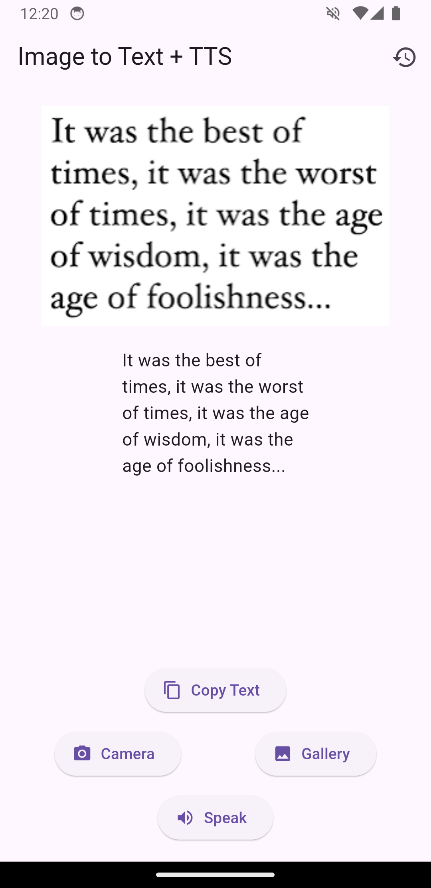
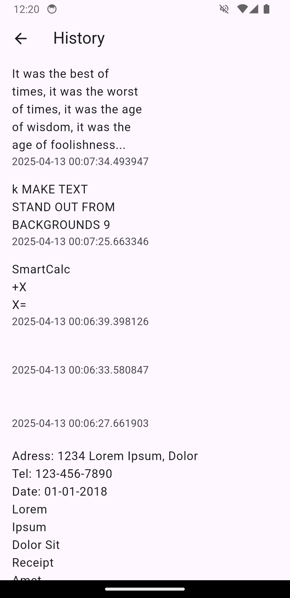

# 🖼️ Create Image to Text + TTS (Text-to-Speech) Flutter App

A Flutter application that extracts text from an image using OCR and reads it aloud using Text-to-Speech — all without any backend! 🚀

---

## ✨ Features

- 📸 Pick image from **camera** or **gallery**
- 🔍 Extract text from the image using **Google ML Kit OCR**
- 🔊 Convert extracted text to speech using **Flutter TTS**
- 📋 Copy recognized text to clipboard
- 📜 View history of scanned images and texts
- 🧠 Built with **GetX** for state management

---

## 📱 Screenshots

| Home Screen | Text Recognition | History |
|-------------|------------------|---------|
|  |  |  |

---

## 🚀 Getting Started

### 📦 Prerequisites
- Flutter 3.10.0 or above
- Android/iOS device or emulator
- Internet not required (Offline functionality)

### 🔧 Installation

```bash
git clone https://github.com/your-username/create_image_to_text.git
cd create_image_to_text
flutter pub get
flutter run


lib/
├── controllers/
│   └── home_controller.dart
├── views/
│   ├── home_view.dart
│   └── history_view.dart
├── models/
│   └── history_model.dart
└── main.dart


Package	Usage
google_ml_kit	Text recognition (OCR)
flutter_tts	Text-to-speech
image_picker	Pick image from camera/gallery
get	State management and navigation
path_provider	Store history locally